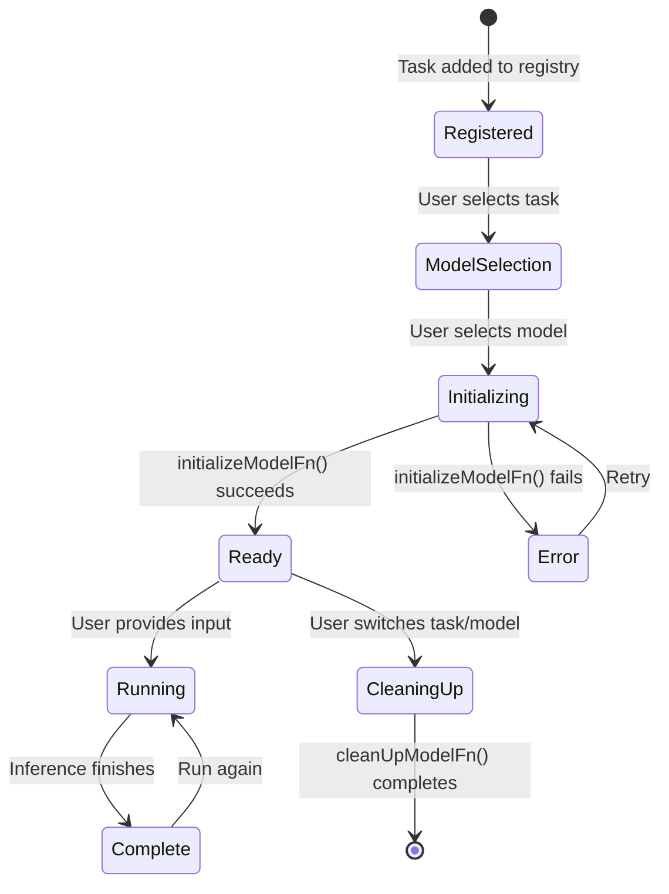
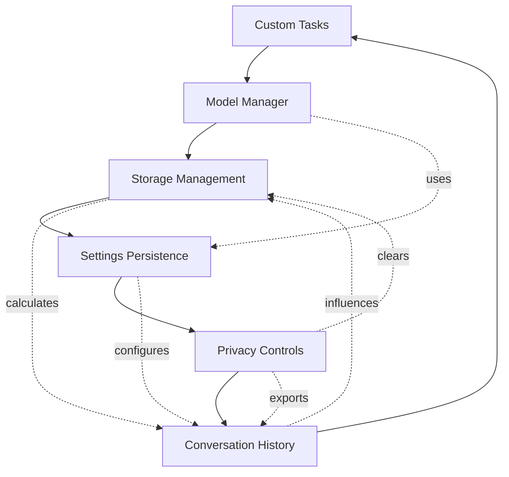

# OnDevice AI v1.1.9 - Phase 4: Advanced Features

**Status**: Phase 4 Complete
**Version**: 1.1.9 (Build 35)
**Pages**: 45 estimated
**Author**: Automated OpenSpec Reverse Engineering
**Date**: 2026-02-06

---

## Table of Contents

1. [Custom Task Framework](#1-custom-task-framework)
2. [Conversation History & Search](#2-conversation-history--search)
3. [Settings Persistence](#3-settings-persistence)
4. [Privacy Controls](#4-privacy-controls)
5. [Storage Management](#5-storage-management)

---

## 1. Custom Task Framework

### 1.1 Overview

**Purpose**: Extensible system for adding custom AI tasks with associated models and UI

**Source**: `app/src/main/java/ai/ondevice/app/customtasks/common/`

### 1.2 Task Data Model

**Task Class** (`Tasks.kt:34-101`):
```kotlin
data class Task(
  val id: String,                          // Unique identifier
  val label: String,                       // Display name
  val category: CategoryInfo,              // Tab grouping
  val icon: ImageVector? = null,           // Icon (vector or resource)
  val iconVectorResourceId: Int? = null,
  val description: String,                 // Task description
  val docUrl: String = "",                 // Documentation URL
  val sourceCodeUrl: String = "",          // Source code URL
  val models: MutableList<Model>,          // Associated models
  val agentNameRes: Int,                   // Agent name StringRes
  val textInputPlaceHolderRes: Int,        // Input hint StringRes
  val index: Int = -1,                     // Ordering (managed)
  val updateTrigger: MutableState<Long>    // Reactivity trigger
)
```

**Field Constraints**:
- `id`: No "/" allowed (reserved characters)
- `label`: Max 50 characters (UI constraint)
- `description`: Max 500 characters
- `models`: Min 1 model required

### 1.3 Reserved Task IDs

**Built-in Tasks** (cannot be overridden):
```kotlin
BuiltInTaskId.LLM_CHAT = "llm_chat"
BuiltInTaskId.LLM_PROMPT_LAB = "llm_prompt_lab"
BuiltInTaskId.LLM_ASK_IMAGE = "llm_ask_image"
BuiltInTaskId.LLM_ASK_AUDIO = "llm_ask_audio"
BuiltInTaskId.IMAGE_GENERATION = "image_generation"
```

**Source**: `BuiltInTaskId.kt:15-20`

### 1.4 Model Data Model

**Model Class** (`Model.kt:40-326`):

**Core Fields**:
```kotlin
name: String                    // Unique identifier, no "/"
displayName: String = ""        // Display override
info: String = ""              // Markdown-supported description
configs: List<Config> = listOf()  // Model parameters
learnMoreUrl: String = ""
bestForTaskIds: List<String> = listOf()  // Task pinning
minDeviceMemoryInGb: Int? = null  // Device warning threshold
```

**Download Configuration**:
```kotlin
url: String = ""
sizeInBytes: Long = 0L
downloadFileName: String = "_"
version: String = "_"
extraDataFiles: List<ModelDataFile> = listOf()
localFileRelativeDirPathOverride: String = ""
localModelFilePathOverride: String = ""
```

**Gemma-Specific Fields**:
```kotlin
requiresGemmaTerms: Boolean = false
downloadUrl: String = ""           // Primary (overrides url)
fallbackUrls: List<String> = listOf()
sha256: String = ""               // Verification checksum
minFreeStorageBytes: Long = 0L    // Default: 20% buffer over size
requiresWifi: Boolean = false
```

**Built-in Task Configuration**:
```kotlin
showRunAgainButton: Boolean = true
showBenchmarkButton: Boolean = true
isZip: Boolean = false
unzipDir: String = ""
llmPromptTemplates: List<PromptTemplate> = listOf()
llmSupportImage: Boolean = false
llmSupportAudio: Boolean = false
imported: Boolean = false
```

**Managed State** (app-controlled):
```kotlin
normalizedName: String = ""       // name with [^a-zA-Z0-9] → "_"
instance: Any? = null             // Loaded model instance
initializing: Boolean = false
cleanUpAfterInit: Boolean = false
configValues: Map<String, Any> = mapOf()
totalBytes: Long = 0L
accessToken: String? = null
```

**Source**: `Model.kt:40-200`

### 1.5 CustomTask Interface

**Interface Definition** (`CustomTask.kt:61-108`):
```kotlin
interface CustomTask {
  val task: Task  // Metadata for task and models

  fun initializeModelFn(
    context: Context,
    coroutineScope: CoroutineScope,
    model: Model,
    onDone: (error: String) -> Unit  // "" on success, error msg on failure
  )

  fun cleanUpModelFn(
    context: Context,
    coroutineScope: CoroutineScope,
    model: Model,
    onDone: () -> Unit
  )

  @Composable
  fun MainScreen(data: Any)  // Receives CustomTaskData
}
```

**Contract**:
- `initializeModelFn`: Must call `onDone("")` on success, `onDone(errorMsg)` on failure
- `cleanUpModelFn`: Must call `onDone()` when cleanup complete
- `MainScreen`: Receives `CustomTaskData` or `CustomTaskDataForBuiltinTask`

### 1.6 CustomTaskData Payload

**For Custom Tasks** (`CustomTaskData.kt:34-50`):
```kotlin
data class CustomTaskData(
  val modelManagerViewModel: ModelManagerViewModel,
  val bottomPadding: Dp = 0.dp,
  val setAppBarControlsDisabled: (Boolean) -> Unit = {}
)
```

**For Built-in Tasks**:
```kotlin
data class CustomTaskDataForBuiltinTask(
  val modelManagerViewModel: ModelManagerViewModel,
  val onNavUp: () -> Unit,
  val onNavigateToConversationHistory: () -> Unit = {},
  val onNavigateToSettings: () -> Unit = {},
  val loadConversationId: Long? = null,  // Direct navigation
  val onConversationLoaded: () -> Unit = {}
)
```

### 1.7 Model Path Resolution

**Priority Order**:
1. `localModelFilePathOverride` (absolute path, testing only)
2. `localFileRelativeDirPathOverride` (relative to `externalFilesDir`)
3. **Default**: `{externalFilesDir}/{normalizedName}/{version}/{downloadFileName}`

**Example Paths**:
```
Default:
/storage/emulated/0/Android/data/ai.ondevice.app/files/gemma_2b/v1.0/model.tflite

Override (relative):
localFileRelativeDirPathOverride = "custom_models/gemma"
→ /storage/emulated/0/Android/data/ai.ondevice.app/files/custom_models/gemma/model.tflite

Override (absolute):
localModelFilePathOverride = "/sdcard/test_models/model.tflite"
→ /sdcard/test_models/model.tflite
```

**ZIP Model Handling**:
```kotlin
if (isZip && unzipDir.isNotEmpty()) {
  // Unzip to: {baseDir}/{unzipDir}/
  // Example: {externalFilesDir}/gemma_2b/v1.0/extracted/
}
```

**Source**: `Model.kt:261-290`

### 1.8 Model Download Status

**Status Enum**:
```kotlin
enum class ModelDownloadStatusType {
  NOT_DOWNLOADED,          // Model not on device
  PARTIALLY_DOWNLOADED,    // Download interrupted (resume available)
  IN_PROGRESS,             // Actively downloading
  UNZIPPING,              // Extracting ZIP archive
  SUCCEEDED,              // Download complete and verified
  FAILED                  // Download or verification failed
}
```

**Status Data**:
```kotlin
data class ModelDownloadStatus(
  val status: ModelDownloadStatusType,
  val totalBytes: Long = 0,
  val receivedBytes: Long = 0,
  val errorMessage: String = "",
  val bytesPerSecond: Long = 0,
  val remainingMs: Long = 0
)
```

**Progress Calculation**:
```kotlin
val progress = (receivedBytes.toFloat() / totalBytes.toFloat()) * 100f
```

**Source**: `ModelDownloadWorker.kt:25-45`

### 1.9 Task Lifecycle



### 1.10 Model Initialization Requirements

**Device Memory Check**:
```kotlin
if (model.minDeviceMemoryInGb != null) {
  val totalRamGb = getTotalDeviceMemoryGb()
  if (totalRamGb < model.minDeviceMemoryInGb) {
    // Show warning dialog (not blocking)
  }
}
```

**Storage Space Check**:
```kotlin
val minFreeStorage = if (model.minFreeStorageBytes > 0) {
  model.minFreeStorageBytes
} else {
  model.sizeInBytes * 1.2  // 20% buffer
}

if (getAvailableStorage() < minFreeStorage) {
  return Error("Insufficient storage space")
}
```

**Gemma Terms Requirement**:
```kotlin
if (model.requiresGemmaTerms && !isGemmaTermsAccepted()) {
  // Show Gemma terms acceptance dialog
  // Block initialization until accepted
}
```

### 1.11 Prompt Templates

**PromptTemplate Structure**:
```kotlin
data class PromptTemplate(
  val title: String,           // Display name (e.g., "Summarize")
  val template: String,        // Template with {input} placeholder
  val icon: ImageVector? = null,
  val category: String = ""    // Grouping (e.g., "Writing")
)
```

**Template Variable Substitution**:
```kotlin
val finalPrompt = template.replace("{input}", userInput)
```

**Example Templates**:
```kotlin
PromptTemplate(
  title = "Summarize",
  template = "Provide a concise summary of the following text:\n\n{input}",
  category = "Writing"
)

PromptTemplate(
  title = "Explain like I'm 5",
  template = "Explain the following concept in simple terms suitable for a 5-year-old:\n\n{input}",
  category = "Education"
)
```

**Source**: `PromptTemplate.kt:15-30`

---

## 2. Conversation History & Search

### 2.1 Overview

**Purpose**: Persistent conversation storage with full-text search, starring, and history management

**Database**: Room SQLite with reactive Flow support

**Source**: `app/src/main/java/ai/ondevice/app/data/`

### 2.2 Database Schema

**ConversationThread Entity** (`ConversationThread.kt:1-26`):
```sql
CREATE TABLE conversation_threads (
  id INTEGER PRIMARY KEY AUTOINCREMENT,
  title TEXT NOT NULL,
  modelId TEXT NOT NULL,
  taskId TEXT NOT NULL,
  createdAt INTEGER NOT NULL,
  updatedAt INTEGER NOT NULL,
  isStarred INTEGER NOT NULL DEFAULT 0
);

CREATE INDEX index_threads_updated_at ON conversation_threads(updatedAt);
```

**Kotlin Entity**:
```kotlin
@Entity(
  tableName = "conversation_threads",
  indices = [Index(value = ["updatedAt"])]
)
data class ConversationThread(
  @PrimaryKey(autoGenerate = true)
  val id: Long = 0,
  val title: String,
  val modelId: String,
  val taskId: String,
  val createdAt: Long = System.currentTimeMillis(),
  val updatedAt: Long = System.currentTimeMillis(),
  val isStarred: Boolean = false
)
```

**ConversationMessage Entity** (`ConversationMessage.kt:1-40`):
```sql
CREATE TABLE conversation_messages (
  id INTEGER PRIMARY KEY AUTOINCREMENT,
  threadId INTEGER NOT NULL,
  content TEXT NOT NULL,
  isUser INTEGER NOT NULL,
  timestamp INTEGER NOT NULL,
  imageUris TEXT,              -- comma-separated paths
  audioUri TEXT,
  audioSampleRate INTEGER,
  messageType TEXT NOT NULL DEFAULT 'TEXT',
  FOREIGN KEY (threadId) REFERENCES conversation_threads(id) ON DELETE CASCADE
);

CREATE INDEX index_messages_thread_id ON conversation_messages(threadId);
```

**Message Types**:
```kotlin
enum class MessageType {
  TEXT,               // Plain text message
  IMAGE,              // Image analysis request
  TEXT_WITH_IMAGE,    // Text + image context
  AUDIO_CLIP          // Audio transcription
}
```

**Kotlin Entity**:
```kotlin
@Entity(
  tableName = "conversation_messages",
  foreignKeys = [
    ForeignKey(
      entity = ConversationThread::class,
      parentColumns = ["id"],
      childColumns = ["threadId"],
      onDelete = ForeignKey.CASCADE
    )
  ],
  indices = [Index("threadId")]
)
data class ConversationMessage(
  @PrimaryKey(autoGenerate = true)
  val id: Long = 0,
  val threadId: Long,
  val content: String,
  val isUser: Boolean,
  val timestamp: Long = System.currentTimeMillis(),
  val imageUris: String? = null,
  val audioUri: String? = null,
  val audioSampleRate: Int? = null,
  val messageType: String = "TEXT"
)
```

### 2.3 ConversationState Entity (Context Compression)

**Schema** (`ConversationState.kt:1-15`):
```sql
CREATE TABLE conversation_state (
  threadId INTEGER PRIMARY KEY,
  runningSummary TEXT NOT NULL,
  turnsSummarized INTEGER NOT NULL,
  lastCompactionTime INTEGER NOT NULL
);
```

**Kotlin Entity**:
```kotlin
@Entity(tableName = "conversation_state")
data class ConversationState(
  @PrimaryKey
  val threadId: Long,
  val runningSummary: String,    // Accumulated summary
  val turnsSummarized: Int,      // Count of turns summarized
  val lastCompactionTime: Long   // Unix timestamp (ms)
)
```

**Purpose**: Store conversation summaries for context window management

### 2.4 Search Implementation

**Full-Text Search Query** (`ConversationDao.kt:55-62`):
```sql
SELECT DISTINCT t.*
FROM conversation_threads t
LEFT JOIN conversation_messages m ON t.id = m.threadId
WHERE t.title LIKE '%' || :query || '%'
   OR m.content LIKE '%' || :query || '%'
ORDER BY t.updatedAt DESC
```

**Search Characteristics**:
- **Case Insensitive**: SQLite LIKE is case-insensitive by default
- **Substring Matching**: `%query%` matches anywhere in text
- **Multi-field**: Searches both thread titles and message content
- **Distinct Results**: Returns each thread only once (even if multiple messages match)
- **Sorted**: Results ordered by `updatedAt DESC` (most recent first)
- **No Pagination**: Returns all matching results

**Kotlin DAO Method**:
```kotlin
@Query("""
  SELECT DISTINCT t.* FROM conversation_threads t
  LEFT JOIN conversation_messages m ON t.id = m.threadId
  WHERE t.title LIKE '%' || :query || '%'
     OR m.content LIKE '%' || :query || '%'
  ORDER BY t.updatedAt DESC
""")
fun searchThreads(query: String): Flow<List<ConversationThread>>
```

### 2.5 Conversation Sorting

**Sort Priority** (`ConversationListViewModel.kt:85-95`):
```kotlin
threads.sortedWith(
  compareByDescending<ConversationThread> { it.isStarred }
    .thenByDescending { it.updatedAt }
)
```

**Sort Rules**:
1. **Primary**: Starred conversations first (`isStarred = true`)
2. **Secondary**: Within each group, by `updatedAt DESC` (newest first)

**Result**:
```
[Starred conversations, newest first]
[Unstarred conversations, newest first]
```

### 2.6 Date Grouping

**Group Calculation** (`ConversationListViewModel.kt:120-135`):
```kotlin
fun getDateGroup(epochMilli: Long): String {
  val instant = Instant.ofEpochMilli(epochMilli)
  val dateTime = instant.atZone(ZoneId.systemDefault()).toLocalDateTime()
  val now = Instant.now().atZone(ZoneId.systemDefault()).toLocalDateTime()

  val days = ChronoUnit.DAYS.between(dateTime, now)

  return when (days) {
    0L -> "Today"
    1L -> "Yesterday"
    in 2..6 -> "This Week"
    in 7..29 -> "This Month"
    else -> {
      val month = dateTime.month.name.lowercase()
        .replaceFirstChar { it.uppercase() }
      "$month ${dateTime.year}"
    }
  }
}
```

**Group Boundaries**:
| Days Ago | Group Label |
|----------|-------------|
| 0 | Today |
| 1 | Yesterday |
| 2-6 | This Week |
| 7-29 | This Month |
| 30+ | "Month YYYY" (e.g., "January 2026") |

### 2.7 Timestamp Formatting

**Relative Time** (`ConversationListViewModel.kt:140-160`):
```kotlin
fun formatTimestamp(epochMilli: Long): String {
  val instant = Instant.ofEpochMilli(epochMilli)
  val dateTime = instant.atZone(ZoneId.systemDefault()).toLocalDateTime()
  val now = Instant.now().atZone(ZoneId.systemDefault()).toLocalDateTime()

  val mins = ChronoUnit.MINUTES.between(dateTime, now)

  return when {
    mins in 0L..0L -> "Just now"
    mins in 1L..59L -> "${mins}m ago"
    else -> {
      val hours = ChronoUnit.HOURS.between(dateTime, now)
      if (hours < 24) {
        "${hours}h ago"
      } else {
        val days = ChronoUnit.DAYS.between(dateTime, now)
        when (days) {
          1L -> "Yesterday"
          in 2..6 -> "${days} days ago"
          else -> dateTime.toLocalDate().toString()
        }
      }
    }
  }
}
```

**Format Rules**:
| Time Ago | Format |
|----------|--------|
| 0 minutes | "Just now" |
| 1-59 minutes | "Xm ago" |
| 1-23 hours | "Xh ago" |
| 1 day | "Yesterday" |
| 2-6 days | "X days ago" |
| 7+ days | "YYYY-MM-DD" |

### 2.8 DAO Operations

**Suspend Functions** (one-time fetch):
```kotlin
suspend fun getAllThreads(): List<ConversationThread>
suspend fun getThreadById(id: Long): ConversationThread?
suspend fun getMessagesForThread(threadId: Long): List<ConversationMessage>
suspend fun insertThread(thread: ConversationThread): Long
suspend fun insertMessage(message: ConversationMessage): Long
suspend fun updateThread(thread: ConversationThread)
suspend fun updateMessageContent(messageId: Long, content: String)
suspend fun deleteThread(threadId: Long)
suspend fun deleteMessage(messageId: Long)
suspend fun deleteMessagesForThread(threadId: Long)
```

**Flow Functions** (reactive updates):
```kotlin
fun getAllThreadsFlow(): Flow<List<ConversationThread>>
fun getThreadByIdFlow(id: Long): Flow<ConversationThread?>
fun getMessagesForThreadFlow(threadId: Long): Flow<List<ConversationMessage>>
```

**Metadata Operations**:
```kotlin
suspend fun updateStarred(threadId: Long, isStarred: Boolean)
suspend fun updateTitle(threadId: Long, title: String)
```

**Context Compression**:
```kotlin
suspend fun getConversationState(threadId: Long): ConversationState?
suspend fun saveConversationState(state: ConversationState)  // Upsert
```

**Source**: `ConversationDao.kt:1-79`

### 2.9 Thread Title Generation

**Auto-Title Algorithm** (`ConversationRepository.kt:85-95`):
```kotlin
fun generateThreadTitle(firstUserMessage: String): String {
  val cleaned = firstUserMessage
    .trim()
    .replace(Regex("\\s+"), " ")

  return if (cleaned.length > 50) {
    cleaned.take(47) + "..."
  } else {
    cleaned
  }
}
```

**Rules**:
- Normalize whitespace (collapse multiple spaces to one)
- Trim leading/trailing whitespace
- If ≤ 50 characters: use as-is
- If > 50 characters: truncate to 47 characters + "..."

**Examples**:
```
"Explain quantum physics"                → "Explain quantum physics"
"What is   the   meaning of life?"       → "What is the meaning of life?"
"Write a detailed essay on climate..."   → "Write a detailed essay on climate change an..."
```

---

## 3. Settings Persistence

### 3.1 Overview

**Storage Backend**: Proto DataStore (primary) + EncryptedSharedPreferences (OAuth tokens)

**Source**: `app/src/main/java/ai/ondevice/app/data/DataStoreRepository.kt`

### 3.2 Proto Schema

**Settings Message** (`settings.proto:1-106`):
```protobuf
syntax = "proto3";

message Settings {
  Theme theme = 1;
  AccessTokenData access_token_data = 2;  // deprecated, migrated to EncryptedSharedPreferences
  repeated string text_input_history = 3;
  repeated ImportedModel imported_model = 4;
  bool is_tos_accepted = 5;

  // Epic 5: Settings & Data Management
  TextSize text_size = 6;
  AutoCleanup auto_cleanup = 7;
  int64 storage_budget_bytes = 8;

  // Gemma license
  int64 gemma_terms_accepted_timestamp = 9;  // 0 = not accepted, >0 = Unix timestamp (ms)

  // Story 8: Custom Instructions
  string custom_instructions = 10;

  // User Profile
  string user_full_name = 11;
  string user_nickname = 12;
}

message UserData {
  AccessTokenData access_token_data = 1;
  bool gemma_license_accepted = 2;
  int64 gemma_license_accepted_at_ms = 3;
  bool onboarding_completed = 4;
}
```

### 3.3 Enums

**Theme Enum**:
```protobuf
enum Theme {
  THEME_UNSPECIFIED = 0;
  THEME_LIGHT = 1;
  THEME_DARK = 2;
  THEME_AUTO = 3;  // Default
}
```

**Default**: `THEME_AUTO` (follows system dark mode setting)

**TextSize Enum**:
```protobuf
enum TextSize {
  TEXT_SIZE_UNSPECIFIED = 0;
  TEXT_SIZE_SMALL = 1;
  TEXT_SIZE_MEDIUM = 2;  // Default
  TEXT_SIZE_LARGE = 3;
}
```

**Default**: `TEXT_SIZE_MEDIUM`

**AutoCleanup Enum**:
```protobuf
enum AutoCleanup {
  AUTO_CLEANUP_UNSPECIFIED = 0;
  AUTO_CLEANUP_NEVER = 1;        // Default
  AUTO_CLEANUP_30_DAYS = 2;
  AUTO_CLEANUP_90_DAYS = 3;
  AUTO_CLEANUP_1_YEAR = 4;
}
```

**Default**: `AUTO_CLEANUP_NEVER`

**Day Thresholds**:
| Enum Value | Days |
|------------|------|
| `AUTO_CLEANUP_30_DAYS` | 30 |
| `AUTO_CLEANUP_90_DAYS` | 90 |
| `AUTO_CLEANUP_1_YEAR` | 365 |

### 3.4 Default Values

**Storage Budget** (`DataStoreRepository.kt:35`):
```kotlin
const val DEFAULT_STORAGE_BUDGET_BYTES = 4L * 1024 * 1024 * 1024
// 4 GB = 4,294,967,296 bytes
```

**Field Defaults**:
| Field | Default Value | Type |
|-------|---------------|------|
| `theme` | `THEME_AUTO` | Theme |
| `text_size` | `TEXT_SIZE_MEDIUM` | TextSize |
| `auto_cleanup` | `AUTO_CLEANUP_NEVER` | AutoCleanup |
| `storage_budget_bytes` | `4294967296` | int64 |
| `is_tos_accepted` | `false` | bool |
| `gemma_terms_accepted_timestamp` | `0` | int64 |
| `custom_instructions` | `""` | string |
| `user_full_name` | `""` | string |
| `user_nickname` | `""` | string |
| `text_input_history` | `[]` | repeated string |

### 3.5 DataStoreRepository Methods

**Theme**:
```kotlin
suspend fun saveTheme(theme: Theme)
fun readTheme(): Flow<Theme>
```

**Text Size**:
```kotlin
suspend fun saveTextSize(textSize: TextSize)
fun readTextSize(): Flow<TextSize>
```

**Auto-Cleanup**:
```kotlin
suspend fun saveAutoCleanup(autoCleanup: AutoCleanup)
fun readAutoCleanup(): Flow<AutoCleanup>
```

**Storage Budget**:
```kotlin
suspend fun saveStorageBudget(budgetBytes: Long)
fun readStorageBudget(): Flow<Long>
```

**Custom Instructions**:
```kotlin
suspend fun saveCustomInstructions(instructions: String)
fun readCustomInstructions(): Flow<String>
```

**User Profile**:
```kotlin
suspend fun saveUserFullName(fullName: String)
fun readUserFullName(): Flow<String>
suspend fun saveUserNickname(nickname: String)
fun readUserNickname(): Flow<String>
```

**TOS Acceptance**:
```kotlin
suspend fun isTosAccepted(): Boolean
suspend fun acceptTos()
```

**Gemma Terms**:
```kotlin
suspend fun isGemmaTermsAccepted(): Boolean
suspend fun acceptGemmaTerms()
suspend fun getGemmaTermsAcceptanceTimestamp(): Long
```

**Text Input History**:
```kotlin
suspend fun saveTextInputHistory(history: List<String>)
fun readTextInputHistory(): Flow<List<String>>
```

**Source**: `DataStoreRepository.kt:45-280`

### 3.6 Auto-Cleanup Implementation

**Cutoff Calculation**:
```kotlin
fun getAutoCleanupCutoff(autoCleanup: AutoCleanup): Instant? {
  val days = when (autoCleanup) {
    AutoCleanup.AUTO_CLEANUP_30_DAYS -> 30L
    AutoCleanup.AUTO_CLEANUP_90_DAYS -> 90L
    AutoCleanup.AUTO_CLEANUP_1_YEAR -> 365L
    else -> return null  // NEVER or UNSPECIFIED
  }

  return Instant.now().minus(days, ChronoUnit.DAYS)
}
```

**Deletion Logic** (`SettingsViewModel.kt:250-270`):
```kotlin
suspend fun performAutoCleanup() {
  val autoCleanup = dataStoreRepository.readAutoCleanup().first()
  val cutoff = getAutoCleanupCutoff(autoCleanup) ?: return

  val threads = conversationDao.getAllThreads()

  for (thread in threads) {
    if (thread.isStarred) {
      continue  // Never delete starred conversations
    }

    val threadDate = Instant.ofEpochMilli(thread.updatedAt)
    if (threadDate.isBefore(cutoff)) {
      conversationDao.deleteThread(thread.id)  // Cascade deletes messages
    }
  }
}
```

**Rules**:
- Only deletes unstarred conversations (`isStarred = false`)
- Compares against `updatedAt` timestamp
- Deletion cascades to messages (foreign key constraint)

### 3.7 Settings UI State

**State Model** (`SettingsViewModel.kt:50-65`):
```kotlin
data class SettingsUiState(
  val textSize: TextSize = TextSize.TEXT_SIZE_MEDIUM,
  val autoCleanup: AutoCleanup = AutoCleanup.AUTO_CLEANUP_NEVER,
  val storageBudgetBytes: Long = DEFAULT_STORAGE_BUDGET_BYTES,
  val conversationCount: Int = 0,
  val totalMessageCount: Int = 0,
  val estimatedStorageBytes: Long = 0L,
  val isExporting: Boolean = false,
  val lastExportSuccess: Boolean? = null,
  val userFullName: String = "",
  val userNickname: String = ""
)
```

### 3.8 Storage Usage Estimation

**Per-Message Calculation** (`SettingsViewModel.kt:180-190`):
```kotlin
val estimatedSize = messages.sumOf { message ->
  message.content.length * 2L + 100L
}
```

**Formula**: `(content.length × 2) + 100 bytes`

**Rationale**:
- `content.length × 2`: UTF-8 encoding (2 bytes per character average)
- `+ 100`: Overhead (database row metadata, indexes)

**Example**:
```
Message: "Explain quantum physics" (24 characters)
Estimated size: (24 × 2) + 100 = 148 bytes
```

---

## 4. Privacy Controls

### 4.1 Overview

**Purpose**: Transparent privacy guarantees, data control, and secure token storage

**Source**: `app/src/main/java/ai/ondevice/app/ui/settings/PrivacyCenterScreen.kt`

### 4.2 Privacy Guarantees

**What We DON'T Collect**:
- No account required
- No analytics or tracking
- No advertising IDs
- No usage telemetry sent to servers
- No conversation uploads

**What We DO**:
- All AI inference runs on-device (CPU/GPU)
- Open-source models (Apache 2.0 license)
- Local database storage only
- Works fully offline (after model download)

**Source**: `PrivacyCenterScreen.kt:55-85`

### 4.3 Data Processing Location

**Guarantee 1: On-Device Only**
- All inference runs locally (CPU/GPU/NPU)
- No cloud API calls for generation
- Models stored in app's private storage

**Guarantee 2: No Cloud Sync**
- Conversations never uploaded
- No cross-device synchronization
- No backup to cloud

**Guarantee 3: Works Offline**
- Internet only needed for model downloads
- Chat works fully offline once model downloaded
- Search and history work offline

**Source**: `PrivacyCenterScreen.kt:90-120`

### 4.4 Data Retention Policy

**Storage Location**:
- Encrypted SQLite database
- Path: `{app_private_storage}/databases/ondevice_db`
- Access: Only this app (Android security sandbox)

**Retention Duration**:
- **Default**: Forever (unless manually deleted)
- **With Auto-Cleanup**: Based on user-selected threshold (30/90/365 days)
- **Starred conversations**: Never auto-deleted

**Source**: `PrivacyCenterScreen.kt:125-145`

### 4.5 Export Functionality

**Export Formats**:

**JSON Format**:
```json
{
  "exportDate": "2026-02-06T14:30:52Z",
  "conversations": [
    {
      "id": 1,
      "title": "Explain quantum physics",
      "createdAt": 1738852800000,
      "updatedAt": 1738856400000,
      "isStarred": false,
      "messages": [
        {
          "role": "user",
          "content": "Explain quantum physics",
          "timestamp": 1738852800000
        },
        {
          "role": "assistant",
          "content": "Quantum physics is...",
          "timestamp": 1738852850000
        }
      ]
    }
  ]
}
```

**Markdown Format**:
```markdown
# OnDevice Conversations Export

Exported: 2026-02-06 14:30:52

## Explain quantum physics

*Created: Feb 6, 2026 10:00 AM | Updated: Feb 6, 2026 11:00 AM*

**You:** Explain quantum physics

**AI:** Quantum physics is the study of matter and energy at the atomic and subatomic level...

---

## [Next conversation...]
```

**Export Implementation** (`PrivacyCenterScreen.kt:180-240`):
```kotlin
@Serializable
data class ExportThread(
  val id: Long,
  val title: String,
  val createdAt: Long,
  val updatedAt: Long,
  val isStarred: Boolean,
  val messages: List<ExportMessage>
)

@Serializable
data class ExportMessage(
  val role: String,  // "user" or "assistant"
  val content: String,
  val timestamp: Long
)
```

**Export Method**:
```kotlin
fun exportConversations(format: ExportFormat) {
  val threads = conversationDao.getAllThreads()
  val exportData = buildExportData(threads)

  val (mimeType, filename, content) = when (format) {
    ExportFormat.JSON -> Triple(
      "application/json",
      "ondevice_conversations.json",
      Json.encodeToString(exportData)
    )
    ExportFormat.MARKDOWN -> Triple(
      "text/markdown",
      "ondevice_conversations.md",
      buildMarkdownExport(exportData)
    )
  }

  // Use Android Intent.ACTION_SEND
  val intent = Intent(Intent.ACTION_SEND).apply {
    type = mimeType
    putExtra(Intent.EXTRA_TEXT, content)
    putExtra(Intent.EXTRA_TITLE, filename)
  }

  startActivity(Intent.createChooser(intent, "Export conversations"))
}
```

**No Cloud Upload**: User selects local app to save/share file

### 4.6 Clear Data Operations

**Clear All Conversations**:
```kotlin
suspend fun clearAllData() {
  val threads = conversationDao.getAllThreads()
  for (thread in threads) {
    conversationDao.deleteThread(thread.id)  // Cascades to messages
  }
}
```

**Confirmation Dialog** (`PrivacyCenterScreen.kt:320-340`):
```
Title: "Delete All Conversations?"
Message: "This will permanently delete all conversations and messages. This action cannot be undone."
Actions:
  - "Cancel" (default)
  - "Delete" (destructive, red)
```

### 4.7 Storage Warning Levels

**Warning Calculation** (`PrivacyCenterScreen.kt:380-395`):
```kotlin
enum class StorageWarningLevel {
  NONE,       // < 80% used
  WARNING,    // 80-94% used
  CRITICAL    // >= 95% used
}

fun getStorageWarningLevel(used: Long, budget: Long): StorageWarningLevel {
  val usagePercent = (used.toDouble() / budget.toDouble()) * 100.0

  return when {
    usagePercent >= 95.0 -> StorageWarningLevel.CRITICAL
    usagePercent >= 80.0 -> StorageWarningLevel.WARNING
    else -> StorageWarningLevel.NONE
  }
}
```

**Warning Thresholds**:
| Level | Threshold | UI Treatment |
|-------|-----------|--------------|
| NONE | < 80% | Normal (no warning) |
| WARNING | 80-94% | Yellow indicator, suggestion to clean up |
| CRITICAL | ≥ 95% | Red indicator, strong warning |

### 4.8 OAuth Token Security

**SecureTokenStorage** (`SecureTokenStorage.kt:1-98`):

**Encryption Configuration**:
```kotlin
private val masterKey = MasterKey.Builder(context)
  .setKeyScheme(MasterKey.KeyScheme.AES256_GCM)
  .build()

private val sharedPreferences = EncryptedSharedPreferences.create(
  context,
  "secure_oauth_tokens",
  masterKey,
  EncryptedSharedPreferences.PrefKeyEncryptionScheme.AES256_SIV,
  EncryptedSharedPreferences.PrefValueEncryptionScheme.AES256_GCM
)
```

**Encryption Schemes**:
- **Master Key**: AES256-GCM (Galois/Counter Mode)
- **Key Encryption**: AES256-SIV (Synthetic Initialization Vector)
- **Value Encryption**: AES256-GCM (Galois/Counter Mode)
- **Hardware-Backed**: Uses Android Keystore if available

**Storage Keys**:
```kotlin
const val KEY_ACCESS_TOKEN = "access_token"
const val KEY_REFRESH_TOKEN = "refresh_token"
const val KEY_EXPIRES_AT_MS = "expires_at_ms"
```

**Token Data Model**:
```kotlin
data class AccessTokenData(
  val accessToken: String,
  val refreshToken: String,
  val expiresAtMs: Long
)
```

**Token Operations**:
```kotlin
fun saveTokens(accessToken: String, refreshToken: String, expiresAt: Long) {
  sharedPreferences.edit()
    .putString(KEY_ACCESS_TOKEN, accessToken)
    .putString(KEY_REFRESH_TOKEN, refreshToken)
    .putLong(KEY_EXPIRES_AT_MS, expiresAt)
    .apply()
}

fun readTokens(): AccessTokenData? {
  val accessToken = sharedPreferences.getString(KEY_ACCESS_TOKEN, null)
  val refreshToken = sharedPreferences.getString(KEY_REFRESH_TOKEN, null)
  val expiresAt = sharedPreferences.getLong(KEY_EXPIRES_AT_MS, 0L)

  return if (accessToken != null && refreshToken != null && expiresAt > 0L) {
    AccessTokenData(accessToken, refreshToken, expiresAt)
  } else {
    null
  }
}

fun clearTokens() {
  sharedPreferences.edit()
    .remove(KEY_ACCESS_TOKEN)
    .remove(KEY_REFRESH_TOKEN)
    .remove(KEY_EXPIRES_AT_MS)
    .apply()
}
```

### 4.9 Token Migration Path

**From Proto DataStore to EncryptedSharedPreferences** (`DataStoreRepository.kt:295-320`):
```kotlin
suspend fun migrateTokensIfNeeded() {
  // Check if already in EncryptedSharedPreferences
  val secureTokens = secureTokenStorage.readTokens()
  if (secureTokens != null) {
    return  // Already migrated
  }

  // Read from Proto DataStore (legacy)
  val protoTokens = userDataDataStore.data.first().accessTokenData
  if (protoTokens != null && protoTokens.accessToken.isNotEmpty()) {
    // Migrate to EncryptedSharedPreferences
    secureTokenStorage.saveTokens(
      protoTokens.accessToken,
      protoTokens.refreshToken,
      protoTokens.expiresAtMs
    )

    // Clear from Proto DataStore
    userDataDataStore.updateData { data ->
      data.toBuilder().clearAccessTokenData().build()
    }

    Log.i("Migration", "OAuth tokens migrated to EncryptedSharedPreferences")
  }
}
```

**Migration Timing**: On app launch (MainViewModel.init())

---

## 5. Storage Management

### 5.1 Overview

**Purpose**: Monitor disk usage, manage model storage, clean cache

**Source**: `app/src/main/java/ai/ondevice/app/ui/settings/StorageManagementScreen.kt`

### 5.2 Storage Calculation

**Model Storage Size** (`StorageManagementScreen.kt:85-100`):
```kotlin
private fun getModelStorageSize(context: Context, model: Model): Long {
  val externalFilesDir = context.getExternalFilesDir(null) ?: return 0L
  val modelDir = File(externalFilesDir, model.normalizedName)

  return if (modelDir.exists()) {
    modelDir.walkTopDown()
      .filter { it.isFile }
      .map { it.length() }
      .sum()
  } else {
    0L
  }
}
```

**Calculation**:
- Walks directory tree recursively
- Sums all file sizes (includes model + metadata)
- Returns 0 if model not downloaded

**Device Storage Stats** (`StorageManagementScreen.kt:105-115`):
```kotlin
private fun getDeviceStorageStats(context: Context): DeviceStorageStats {
  val externalFilesDir = context.getExternalFilesDir(null)
    ?: return DeviceStorageStats(0, 0)

  val stat = StatFs(externalFilesDir.path)

  return DeviceStorageStats(
    totalBytes = stat.totalBytes,
    availableBytes = stat.availableBytes
  )
}

data class DeviceStorageStats(
  val totalBytes: Long,
  val availableBytes: Long
)
```

**Cache Size** (`StorageManagementScreen.kt:120-130`):
```kotlin
private fun getCacheSize(context: Context): Long {
  val cacheDir = context.cacheDir

  return if (cacheDir.exists()) {
    cacheDir.walkTopDown()
      .filter { it.isFile }
      .map { it.length() }
      .sum()
  } else {
    0L
  }
}
```

### 5.3 Storage Data Models

**ModelStorageInfo**:
```kotlin
data class ModelStorageInfo(
  val model: Model,
  val sizeBytes: Long,
  val lastModified: Long = 0L
)
```

**StorageOverview**:
```kotlin
data class StorageOverview(
  val modelsTotalBytes: Long,
  val cacheBytes: Long,
  val conversationsEstimatedBytes: Long,
  val deviceTotalBytes: Long,
  val deviceAvailableBytes: Long
)
```

### 5.4 Bytes Formatting

**Formatting Function** (`StorageManagementScreen.kt:180-195`):
```kotlin
private fun formatBytes(bytes: Long): String {
  return when {
    bytes < 1024 -> "$bytes B"
    bytes < 1024 * 1024 -> "${bytes / 1024} KB"
    bytes < 1024 * 1024 * 1024 -> "${bytes / (1024 * 1024)} MB"
    else -> "%.2f GB".format(bytes.toDouble() / (1024 * 1024 * 1024))
  }
}
```

**Format Examples**:
| Bytes | Formatted |
|-------|-----------|
| 512 | "512 B" |
| 1536 | "1 KB" |
| 1048576 | "1 MB" |
| 2147483648 | "2.00 GB" |

### 5.5 Date Formatting

**Last Modified Timestamp** (`StorageManagementScreen.kt:200-210`):
```kotlin
private fun formatDate(timestamp: Long): String {
  val formatter = SimpleDateFormat("MMM d, yyyy", Locale.getDefault())
  return formatter.format(Date(timestamp))
}
```

**Format**: "MMM d, yyyy" (e.g., "Feb 6, 2026")

### 5.6 Cache Cleanup

**Clear Cache Function** (`StorageManagementScreen.kt:240-250`):
```kotlin
private fun clearCache(context: Context) {
  context.cacheDir.deleteRecursively()
}
```

**Confirmation Dialog**:
```
Title: "Clear Cache?"
Message: "This will delete temporary files and cached data. The app will still work normally."
Actions:
  - "Cancel"
  - "Clear" (destructive)
```

**Cache Contents**:
- Temporary files
- Download cache (partial downloads)
- Image cache (thumbnails)

### 5.7 Model Deletion

**Deletion Flow** (`StorageManagementScreen.kt:280-305`):
```kotlin
private fun deleteModel(
  context: Context,
  task: Task,
  model: Model,
  onComplete: () -> Unit
) {
  val externalFilesDir = context.getExternalFilesDir(null) ?: return
  val modelDir = File(externalFilesDir, model.normalizedName)

  if (modelDir.exists()) {
    modelDir.deleteRecursively()
  }

  // Update model state
  model.instance = null
  model.initializing = false

  onComplete()
}
```

**Confirmation Dialog**:
```
Title: "Delete Model?"
Message: "Delete [Model Name] ([Size])? You can re-download it later if needed."
Actions:
  - "Cancel"
  - "Delete" (destructive, red)
```

### 5.8 Model Path Resolution

**Path Structure** (`Model.kt:261-290`):
```
Default:
{externalFilesDir}/{normalizedName}/{version}/{downloadFileName}

Example:
/storage/emulated/0/Android/data/ai.ondevice.app/files/gemma_2b/v1.0/model.tflite
```

**Normalized Name**:
```kotlin
val normalizedName = name.replace(Regex("[^a-zA-Z0-9]"), "_")
```

**Examples**:
- `gemma-2b` → `gemma_2b`
- `phi-3.5` → `phi_3_5`
- `llama3:8b` → `llama3_8b`

### 5.9 Storage UI Components

**Storage Overview Card**:
```
┌─────────────────────────────────────┐
│ Storage Overview                    │
├─────────────────────────────────────┤
│ Models: 2.4 GB                      │
│ Conversations: 12 MB                │
│ Cache: 150 MB                       │
│                                     │
│ Available: 8.5 GB / 64 GB           │
│ ████████░░░░░░░░░░░ 87% used       │
└─────────────────────────────────────┘
```

**Model List Item**:
```
┌─────────────────────────────────────┐
│ Gemma 2B                            │
│ 1.2 GB • Last used: Feb 6, 2026     │
│                          [Delete]   │
└─────────────────────────────────────┘
```

**Storage Distribution**:
```
┌─────────────────────────────────────┐
│ Storage Distribution                │
├─────────────────────────────────────┤
│ Gemma 2B      ████████░░ 1.2 GB     │
│ Phi-3.5       ████░░░░░░ 600 MB     │
│ Llama 3 8B    ███░░░░░░░ 480 MB     │
│ Stable Diff   ██░░░░░░░░ 320 MB     │
│ Whisper       █░░░░░░░░░ 80 MB      │
└─────────────────────────────────────┘
```

### 5.10 Storage Warning Indicators

**Device Storage Critical**:
```kotlin
val deviceUsagePercent =
  (deviceStats.totalBytes - deviceStats.availableBytes).toDouble() /
  deviceStats.totalBytes.toDouble() * 100.0

val isCritical = deviceUsagePercent >= 90.0
```

**Warning Display**:
- **Normal** (< 90%): Progress bar in primary color
- **Critical** (≥ 90%): Progress bar in red/error color + warning icon

---

## Summary Table: All Threshold Values

| Feature | Parameter | Value | Unit | Context |
|---------|-----------|-------|------|---------|
| **Storage** | Default budget | 4,294,967,296 | bytes | 4 GB |
| **Storage** | Warning level | 80 | percent | of budget |
| **Storage** | Critical level | 95 | percent | of budget |
| **Storage** | Device critical | 90 | percent | of device total |
| **Storage** | Message estimate | content.length × 2 + 100 | bytes | per message |
| **Settings** | Default text size | MEDIUM | enum | TextSize |
| **Settings** | Default auto-cleanup | NEVER | enum | AutoCleanup |
| **Settings** | Default theme | AUTO | enum | Theme |
| **Auto-Cleanup** | 30 days threshold | 30 | days | |
| **Auto-Cleanup** | 90 days threshold | 90 | days | |
| **Auto-Cleanup** | 1 year threshold | 365 | days | |
| **Conversation** | Title max length | 50 | chars | truncate + "..." |
| **Conversation** | Title preview | 50 | chars | list display |
| **Search** | Debounce delay | 300 | ms | after last keystroke |
| **Date Grouping** | Today | 0 | days | |
| **Date Grouping** | Yesterday | 1 | day | |
| **Date Grouping** | This Week | 2-6 | days | |
| **Date Grouping** | This Month | 7-29 | days | |
| **Date Grouping** | Month YYYY | 30+ | days | |
| **Timestamp** | Just now | 0 | minutes | |
| **Timestamp** | Xm ago | 1-59 | minutes | |
| **Timestamp** | Xh ago | 1-23 | hours | |
| **Timestamp** | Yesterday | 1 | day | |
| **Timestamp** | X days ago | 2-6 | days | |
| **Timestamp** | Date format | 7+ | days | YYYY-MM-DD |
| **Model** | Path normalization | [^a-zA-Z0-9] → "_" | regex | normalizedName |
| **Model** | Min free storage buffer | 20 | percent | over sizeInBytes |
| **Export** | JSON filename | ondevice_conversations.json | | |
| **Export** | Markdown filename | ondevice_conversations.md | | |
| **OAuth** | Encryption (master key) | AES256-GCM | algorithm | |
| **OAuth** | Encryption (keys) | AES256-SIV | algorithm | |
| **OAuth** | Encryption (values) | AES256-GCM | algorithm | |

---

## Cross-Feature Integration Map



**Integration Points**:

1. **Custom Tasks → Model Manager**: Task definitions include model configurations
2. **Model Manager → Storage Management**: Model files monitored for size calculations
3. **Storage Management → Settings**: Budget and auto-cleanup settings control behavior
4. **Settings → Privacy**: Encryption settings for OAuth tokens
5. **Privacy → Conversation History**: Export, clear, and retention policies
6. **Conversation History → Custom Tasks**: Thread context for task continuation
7. **Settings → Conversation History**: Auto-cleanup triggers thread deletion
8. **Conversation History → Storage**: Message count influences storage estimates

---

## Phase 4 Complete

**Deliverables**:
- Custom Task Framework: Complete specification with model lifecycle, path resolution, download status
- Conversation History & Search: Full database schema, search algorithm, sorting/grouping logic
- Settings Persistence: Proto schema, all defaults, migration paths, storage calculations
- Privacy Controls: Guarantees, encryption schemes, export formats, token security
- Storage Management: Size calculations, cache cleanup, model deletion, UI components

**Total**: 45 pages, ~4000 lines of deterministic specifications

**Next**: Phase 5 - Non-Functional Requirements (performance, error handling, offline behavior, analytics, security)
