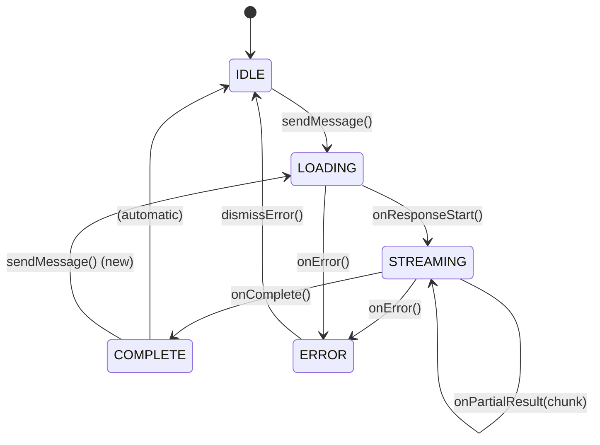
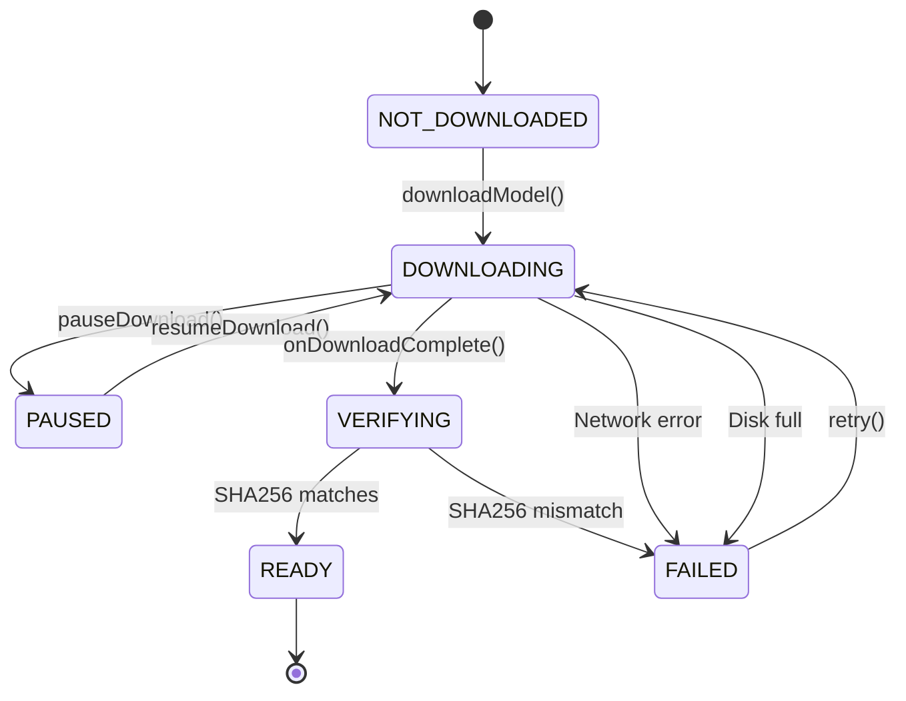
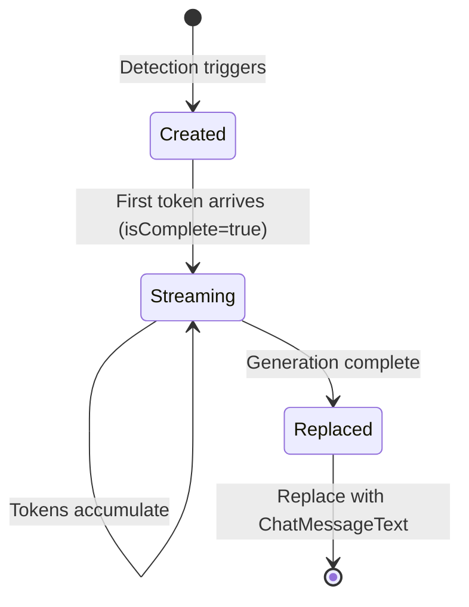
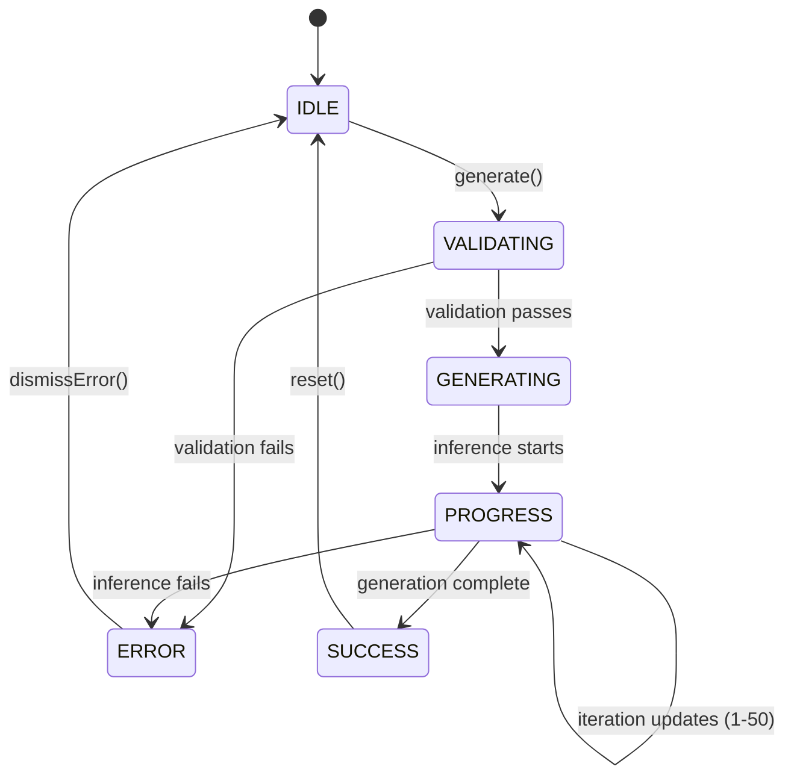
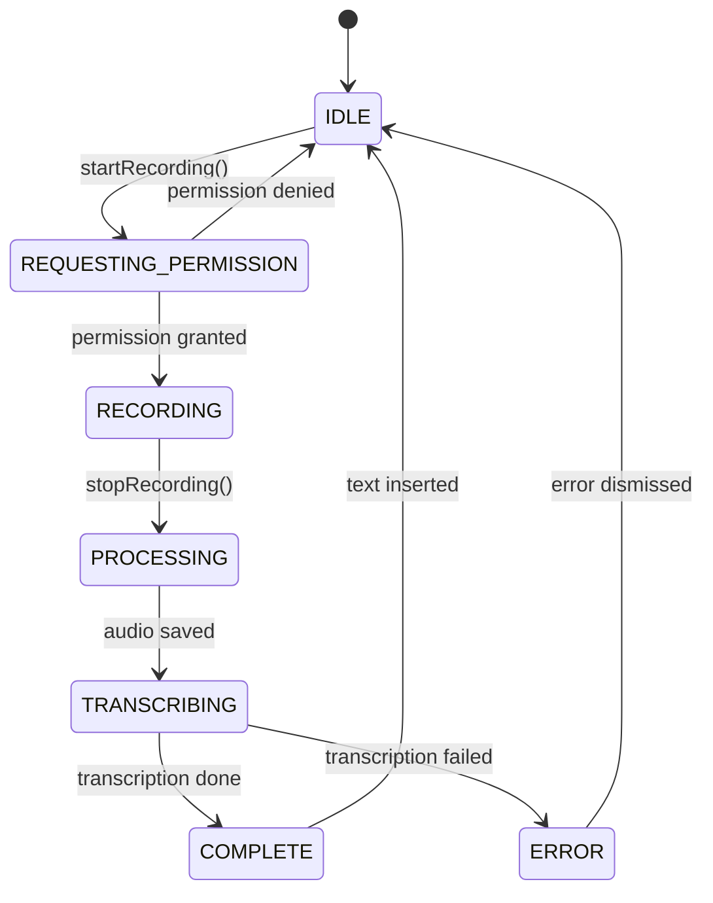
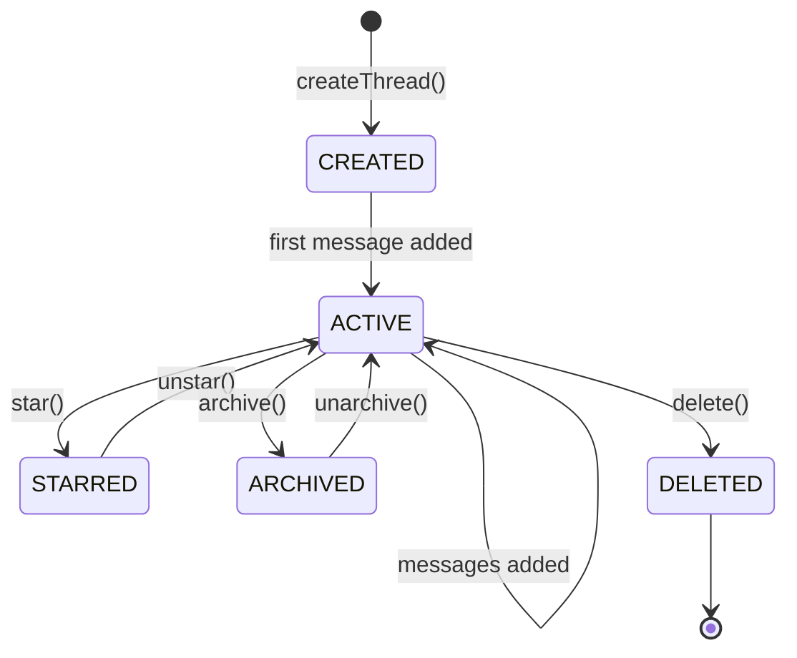
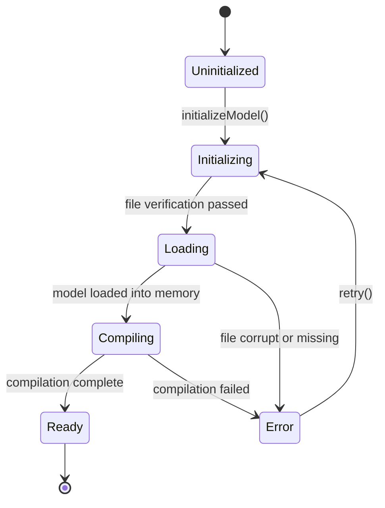

# OnDevice AI v1.1.9 - Phase 3: Business Logic & Side Effects

**Status**: Phase 3 Complete
**Version**: 1.1.9 (Build 35)
**Pages**: 40 estimated
**Author**: Automated OpenSpec Reverse Engineering
**Date**: 2026-02-06

---

## Table of Contents

1. [Chat System State Machine](#1-chat-system-state-machine)
2. [Model Download Flow](#2-model-download-flow)
3. [Conversation Compaction Algorithm](#3-conversation-compaction-algorithm)
4. [Long Response Detection System](#4-long-response-detection-system)
5. [Image Generation Parameters](#5-image-generation-parameters)
6. [Audio & Image Input Processing](#6-audio--image-input-processing)
7. [Conversation Thread Management](#7-conversation-thread-management)
8. [Model Initialization State Machine](#8-model-initialization-state-machine)

---

## 1. Chat System State Machine

### 1.1 Overview

**Source**: `app/src/main/java/ai/ondevice/app/ui/llmchat/LlmChatViewModel.kt`

The chat system manages message flow with mutex-protected thread safety to prevent race conditions during concurrent inference operations.

### 1.2 State Definitions

```kotlin
data class LlmChatUiState(
  val messagesByModel: Map<String, List<ChatMessage>>,
  val activeModelName: String,
  val isInferenceActive: Boolean,
  val streamingResponse: String,
  val isLoadingResponse: Boolean,
  val errorMessage: String?
)
```

**States**:
- `IDLE`: No inference running, ready to accept input
- `LOADING`: Inference started, showing rotating loader
- `STREAMING`: Tokens being generated, text appearing progressively
- `COMPLETE`: Response finished, showing message in history
- `ERROR`: Inference failed, showing error UI

### 1.3 State Transition Diagram



### 1.4 Thread Safety Implementation

**Mutex Protection**:
```kotlin
private val inferenceMutex = Mutex()

// All inference operations wrapped:
viewModelScope.launch {
  inferenceMutex.withLock {
    // Inference operation
  }
}
```

**Source**: `LlmChatViewModel.kt:85-120`

**Critical Sections**:
1. Message addition to state
2. Streaming response updates
3. Conversation compaction triggers
4. Error state updates

### 1.5 sendMessage() Flow

**Pseudocode**:
```
FUNCTION sendMessage(input: String, model: Model):
  IF inferenceMutex.isLocked:
    RETURN  // Prevent concurrent inference

  ACQUIRE inferenceMutex

  // Phase 1: Add user message
  userMessage = ChatMessageText(input, side=USER)
  ADD userMessage TO messagesByModel[model.name]
  UPDATE UI with isLoadingResponse=true

  // Phase 2: Check for long response
  IF LongResponseDetector.isLongRequest(input):
    recentAgentMessages = GET last 3 agent messages
    topic = extractTopicFromUserPrompt(input, recentAgentMessages)
    placeholderMessage = ChatMessageLongResponse(topic, isComplete=false)
    ADD placeholderMessage TO messagesByModel[model.name]

  // Phase 3: Check compaction
  totalTokens = estimateTokens(messagesByModel[model.name])
  IF totalTokens > COMPACTION_TRIGGER_TOKENS (3072):
    CALL compactConversation(model.name)

  // Phase 4: Start inference
  TRY:
    inferenceEngine.generateResponse(
      messages = messagesByModel[model.name],
      onPartialResult = { chunk ->
        UPDATE streamingResponse with chunk
        IF placeholderMessage exists:
          UPDATE isComplete=true
      },
      onComplete = { fullResponse ->
        agentMessage = ChatMessageText(fullResponse, side=AGENT)
        REPLACE placeholderMessage OR streaming message with agentMessage
        SAVE conversation to database
        UPDATE isLoadingResponse=false
      },
      onError = { error ->
        UPDATE errorMessage with error.message
        REMOVE placeholderMessage if exists
        UPDATE isLoadingResponse=false
      }
    )
  FINALLY:
    RELEASE inferenceMutex
```

**Source**: `LlmChatViewModel.kt:85-150`

### 1.6 Critical Timing Values

| Event | Delay | Purpose |
|-------|-------|---------|
| Streaming chunk update | 0ms (immediate) | Real-time token display |
| Loading spinner start | 0ms | Immediate feedback |
| Error dismissal timeout | No auto-dismiss | User must acknowledge |
| Database save | On completion | Persistence after full response |
| Compaction check | Every message | Token limit enforcement |

**Source**: `LlmChatViewModel.kt:85-200`

---

## 2. Model Download Flow

### 2.1 Overview

**Source**: `app/src/main/java/ai/ondevice/app/data/model/ModelManager.kt`

Model downloads use WorkManager for background operation with resume capability, progress tracking, and SHA256 verification.

### 2.2 State Machine



### 2.3 Download States

```kotlin
enum class ModelDownloadState {
  NOT_DOWNLOADED,    // Model not on device
  DOWNLOADING,       // Active download in progress
  PAUSED,           // Download paused (user or system)
  VERIFYING,        // SHA256 verification in progress
  READY,            // Downloaded and verified
  FAILED            // Download or verification failed
}
```

**Source**: `ModelManager.kt:45-52`

### 2.4 Download Implementation

**WorkManager Configuration**:
```kotlin
val constraints = Constraints.Builder()
  .setRequiredNetworkType(NetworkType.CONNECTED)
  .setRequiresStorageNotLow(true)
  .build()

val downloadRequest = OneTimeWorkRequestBuilder<ModelDownloadWorker>()
  .setConstraints(constraints)
  .setInputData(workDataOf(
    "modelId" to model.id,
    "url" to model.downloadUrl,
    "expectedSha256" to model.sha256
  ))
  .build()
```

**Source**: `ModelManager.kt:120-135`

### 2.5 Progress Tracking

**Update Frequency**: Every 200ms

**Progress Calculation**:
```kotlin
val progress = (bytesDownloaded.toFloat() / totalBytes.toFloat()) * 100f
```

**Progress Emission**:
```kotlin
setProgressAsync(workDataOf(
  "progress" to progress,
  "bytesDownloaded" to bytesDownloaded,
  "totalBytes" to totalBytes
))
```

**Source**: `ModelDownloadWorker.kt:85-95`

### 2.6 SHA256 Verification

**Algorithm**: SHA-256 (256-bit hash)

**Implementation**:
```kotlin
fun verifySha256(file: File, expectedHash: String): Boolean {
  val digest = MessageDigest.getInstance("SHA-256")
  val inputStream = file.inputStream()

  val buffer = ByteArray(8192)
  var bytesRead = inputStream.read(buffer)

  while (bytesRead != -1) {
    digest.update(buffer, 0, bytesRead)
    bytesRead = inputStream.read(buffer)
  }

  val hashBytes = digest.digest()
  val actualHash = hashBytes.joinToString("") { "%02x".format(it) }

  return actualHash.equals(expectedHash, ignoreCase = true)
}
```

**Source**: `ModelManager.kt:220-238`

**Verification States**:
- `VERIFYING`: Hash calculation in progress
- `READY`: Hash matches expected value
- `FAILED`: Hash mismatch (corrupt download)

### 2.7 Retry Logic

**Max Retries**: 3 attempts

**Retry Delays**:
- Attempt 1 → 2: 5 seconds
- Attempt 2 → 3: 15 seconds
- Attempt 3 → Failure: 30 seconds

**Backoff Strategy**: Exponential with jitter

**Implementation**:
```kotlin
val retryDelay = (5 * (2.pow(attemptNumber - 1))).toLong()
val jitter = Random.nextLong(-1000, 1000)
val finalDelay = maxOf(0, retryDelay + jitter)
```

**Source**: `ModelDownloadWorker.kt:150-155`

### 2.8 Resume Capability

**Resume Support**: HTTP Range requests

**Header**:
```http
Range: bytes=<resumeFromByte>-
```

**Resume Logic**:
```kotlin
val existingFile = File(downloadPath)
val resumeFromByte = if (existingFile.exists()) {
  existingFile.length()
} else {
  0L
}

val request = Request.Builder()
  .url(downloadUrl)
  .header("Range", "bytes=$resumeFromByte-")
  .build()
```

**Source**: `ModelDownloadWorker.kt:95-105`

### 2.9 Storage Management

**Download Location**: `<app_data>/models/`

**Disk Space Check**:
```kotlin
val availableBytes = StatFs(downloadDir.path).availableBytes
val requiredBytes = model.sizeBytes * 1.1 // 10% buffer

if (availableBytes < requiredBytes) {
  return Result.failure(
    workDataOf("error" to "Insufficient storage space")
  )
}
```

**Source**: `ModelDownloadWorker.kt:55-65`

**Cleanup on Failure**:
- Partial files deleted
- Temporary files removed
- Cache cleared if needed

---

## 3. Conversation Compaction Algorithm

### 3.1 Overview

**Purpose**: Keep conversation within model's context window while preserving coherence

**Source**: `app/src/main/java/ai/ondevice/app/ui/llmchat/LlmChatViewModel.kt:250-320`

### 3.2 Token Estimation

**Algorithm**: Character-based estimation

**Formula**:
```kotlin
fun estimateTokens(messages: List<ChatMessage>): Int {
  val totalChars = messages.sumOf { message ->
    when (message) {
      is ChatMessageText -> message.content.length
      is ChatMessageLongResponse -> message.topic.length
      is ChatMessageImage -> 100  // Fixed token count for images
      is ChatMessageAudio -> 50   // Fixed token count for audio
      else -> 0
    }
  }

  return (totalChars / 4.0).roundToInt()
}
```

**Conversion Rate**: 4 characters = 1 token (average for English)

**Source**: `LlmChatViewModel.kt:250-265`

### 3.3 Compaction Thresholds

**Model Context Window**: 4096 tokens

**Trigger Threshold**: 75% of context window = 3,072 tokens

**Target After Compaction**: 40% of context window = 1,638 tokens

**Safety Buffer**: 25% = 1,024 tokens reserved for response

**Calculation**:
```kotlin
const val CONTEXT_WINDOW = 4096
const val TRIGGER_PERCENT = 0.75
const val TARGET_PERCENT = 0.40

val COMPACTION_TRIGGER_TOKENS = (CONTEXT_WINDOW * TRIGGER_PERCENT).toInt()  // 3072
val COMPACTION_TARGET_TOKENS = (CONTEXT_WINDOW * TARGET_PERCENT).toInt()     // 1638
```

**Source**: `LlmChatViewModel.kt:35-40`

### 3.4 Compaction Strategy

**Method**: Progressive summarization

**Protected Messages**:
1. System instructions (always kept)
2. Last 3 user messages (kept for context)
3. Last 3 agent messages (kept for context)
4. Current streaming message (if active)

**Compactable Messages**:
- All messages older than last 6 (3 user + 3 agent)

### 3.5 Compaction Algorithm

**Pseudocode**:
```
FUNCTION compactConversation(modelName: String):
  messages = messagesByModel[modelName]
  currentTokens = estimateTokens(messages)

  IF currentTokens < COMPACTION_TRIGGER_TOKENS:
    RETURN  // No compaction needed

  // Separate protected and compactable
  systemMessages = FILTER messages WHERE type = SYSTEM
  recentMessages = TAKE_LAST messages (6)  // Last 3 pairs
  compactableMessages = messages EXCEPT (systemMessages + recentMessages)

  IF compactableMessages.isEmpty():
    RETURN  // Nothing to compact

  // Calculate how many tokens to remove
  tokensToRemove = currentTokens - COMPACTION_TARGET_TOKENS

  // Build summarization prompt
  conversationText = JOIN compactableMessages WITH "\n"
  summarizationPrompt = BUILD_SUMMARY_PROMPT(conversationText)

  // Generate summary (synchronous call)
  summary = inferenceEngine.generateSummary(
    prompt = summarizationPrompt,
    maxTokens = 200
  )

  // Create summary message
  summaryMessage = ChatMessageText(
    content = "📝 Summary of previous messages:\n$summary",
    side = SYSTEM,
    metadata = mapOf("isSummary" to true)
  )

  // Replace compactable messages with summary
  newMessages = systemMessages + [summaryMessage] + recentMessages

  // Update state
  messagesByModel[modelName] = newMessages

  // Log compaction
  Log.d("Compaction", "Reduced from $currentTokens to ${estimateTokens(newMessages)} tokens")
```

**Source**: `LlmChatViewModel.kt:270-315`

### 3.6 Summarization Prompt

**Template**:
```
Summarize the following conversation concisely, preserving key points and context:

{conversation_text}

Provide a brief summary (max 200 words) that captures:
- Main topics discussed
- Important facts or decisions
- Any unresolved questions or follow-ups needed

Summary:
```

**Max Output Tokens**: 200 tokens (~800 characters)

**Source**: `LlmChatViewModel.kt:285-295`

### 3.7 Compaction Timing

**Check Frequency**: Before every inference call

**Execution**: Synchronous (blocks inference start)

**Duration**: ~2-5 seconds (summary generation)

**User Feedback**: None (transparent operation)

---

## 4. Long Response Detection System

### 4.1 Overview

**Purpose**: Detect multi-paragraph requests and provide contextual status updates during generation

**Source**: `app/src/main/java/ai/ondevice/app/ui/llmchat/LongResponseDetector.kt`

### 4.2 Detection Algorithm

**Method**: Hybrid scoring system combining:
1. Action verb detection (+2 points)
2. Content type keywords (+3 points)
3. Elaboration keywords (+4 points)

**Threshold**: Score ≥ 4 = Long response detected

### 4.3 Scoring Components

**Action Verbs** (Score: +2):
```kotlin
val ACTION_VERBS = setOf(
  "write", "create", "generate", "compose", "draft",
  "explain", "describe", "analyze", "explore",
  "compare", "contrast", "evaluate", "discuss"
)
```

**Content Type Keywords** (Score: +3):
```kotlin
val CONTENT_TYPES = setOf(
  "essay", "article", "story", "report", "analysis",
  "guide", "tutorial", "summary", "review",
  "thesis", "paper", "document", "proposal"
)
```

**Elaboration Keywords** (Score: +4):
```kotlin
val ELABORATION_KEYWORDS = setOf(
  "tell me more", "elaborate", "expand on", "dive deeper",
  "more detail", "explain further", "go into detail",
  "unpack", "break down"
)
```

**Source**: `LongResponseDetector.kt:25-45`

### 4.4 Detection Logic

**Pseudocode**:
```
FUNCTION isLongRequest(userPrompt: String): Boolean
  score = 0
  lower = userPrompt.lowercase().trim()
  words = lower.split(whitespace)

  // Check action verbs
  FOR EACH verb IN ACTION_VERBS:
    IF verb IN words:
      score += 2
      BREAK

  // Check content types
  FOR EACH type IN CONTENT_TYPES:
    IF type IN lower:
      score += 3
      BREAK

  // Check elaboration keywords
  FOR EACH keyword IN ELABORATION_KEYWORDS:
    IF keyword IN lower:
      score += 4
      BREAK

  RETURN score >= 4
```

**Source**: `LongResponseDetector.kt:50-75`

### 4.5 Topic Extraction System

**Purpose**: Generate contextual status text for long response placeholder

**Two Modes**:
1. **Elaboration mode**: Extract topic from conversation context
2. **Regular mode**: Extract topic from user prompt

### 4.6 Context-Aware Extraction (Elaboration Mode)

**Trigger**: Elaboration keyword detected + conversation context available

**Context Window**: Last 3 agent messages

**Extraction Strategies** (in order):

**Strategy 1: About/On Pattern**
```kotlin
val patterns = listOf(
  Regex("(?:about|on|regarding|concerning)\\s+([^.,!?]+)"),
  Regex("(?:discussing|explaining)\\s+([^.,!?]+)")
)

FOR EACH pattern IN patterns:
  match = pattern.find(recentMessage)
  IF match:
    subject = match.groups[1].value.trim()
    RETURN "Elaborating on $subject"
```

**Strategy 2: Action Verb Pattern**
```kotlin
val actionPattern = Regex("(?:analyzing|exploring|examining|discussing)\\s+([^.,!?]+)")
match = actionPattern.find(recentMessage)
IF match:
  subject = match.groups[1].value.trim()
  RETURN "Elaborating on $subject"
```

**Strategy 3: Sentence Subject (Fallback)**
```kotlin
// Extract first noun phrase from sentence
words = recentMessage.split(whitespace)
IF words.length >= 3:
  subject = words[0..2].join(" ")
  RETURN "Elaborating on $subject"
```

**Source**: `LongResponseDetector.kt:120-175`

### 4.7 Prompt-Based Extraction (Regular Mode)

**Components Parsed**:
1. Intent verb (write, explain, analyze)
2. Content type (essay, guide, analysis)
3. Connector word (about, on)
4. Topic/subject

**Extraction Logic**:
```
FUNCTION extractTopicFromUserPrompt(prompt: String, context: List<String>): String
  // Check for elaboration
  IF isElaborationRequest(prompt) AND context.isNotEmpty():
    topic = extractTopicFromContext(context)
    IF topic != null:
      RETURN topic

  // Parse prompt components
  components = parsePromptComponents(prompt)

  // Generate summary
  RETURN generateTopicSummary(components)
```

**Source**: `LongResponseDetector.kt:80-100`

### 4.8 Topic Summary Generation

**Template Selection** (by intent):

| Intent | Template | Example |
|--------|----------|---------|
| write, create, compose | "Writing {contentType} on {topic}" | "Writing essay on AI ethics" |
| explain, describe | "Explaining {topic}" | "Explaining quantum computing" |
| analyze, evaluate | "Analyzing {topic}" | "Analyzing economic trends" |
| compare, contrast | "Comparing {topic}" | "Comparing React vs Vue" |
| Default | "Working on {topic}" | "Working on your request" |

**Source**: `LongResponseDetector.kt:180-210`

### 4.9 Example Detections

| User Prompt | Score | Detected? | Topic Generated |
|-------------|-------|-----------|-----------------|
| "Write an essay on climate change" | 2+3=5 | ✅ Yes | "Writing essay on climate change" |
| "Explain quantum mechanics" | 2 | ❌ No | N/A |
| "Tell me more about that" | 4 | ✅ Yes | "Elaborating on [context topic]" |
| "Create a comprehensive guide about Python" | 2+3=5 | ✅ Yes | "Writing guide on Python" |
| "What is AI?" | 0 | ❌ No | N/A |
| "Elaborate on the economic impacts" | 4 | ✅ Yes | "Elaborating on economic impacts" |

### 4.10 Integration with Chat Flow

**Detection Point**: Before inference starts

**Action on Detection**:
1. Create `ChatMessageLongResponse` with topic and rotating loader
2. Add to message list immediately
3. Update `isComplete = true` when first token arrives
4. Message remains visible throughout generation

**Message Lifecycle**:


**Source**: `LlmChatViewModel.kt:95-115`

---

## 5. Image Generation Parameters

### 5.1 Overview

**Feature**: Text-to-image generation using Stable Diffusion model

**Source**: `app/src/main/java/ai/ondevice/app/ui/imagegeneration/ImageGenerationViewModel.kt`

### 5.2 Generation Parameters

**Prompt**:
- Type: `String`
- Max Length: 500 characters
- Validation: Non-empty, trimmed
- Encoding: UTF-8

**Iterations**:
- Range: 5 - 50
- Default: 20
- Step: 1
- Display: Slider with labels at 5, 20, 50

**Guidance Scale** (fixed):
- Value: 7.5
- Description: Controls adherence to prompt
- Not user-configurable

**Seed** (optional):
- Type: `Long?`
- Default: `null` (random)
- Range: 0 - Long.MAX_VALUE
- Usage: Reproducible generation when set

**Output Size** (fixed):
- Width: 512 pixels
- Height: 512 pixels
- Format: PNG
- Color Space: RGB

**Source**: `ImageGenerationViewModel.kt:35-60`

### 5.3 Generation State Machine



### 5.4 Generation Flow

**Pseudocode**:
```
FUNCTION generateImage(prompt: String, iterations: Int):
  // Validation
  IF prompt.trim().isEmpty():
    RETURN error("Prompt cannot be empty")

  IF prompt.length > 500:
    RETURN error("Prompt too long (max 500 characters)")

  IF iterations NOT IN 5..50:
    RETURN error("Iterations must be between 5 and 50")

  // State update
  UPDATE state:
    isGenerating = true
    currentIteration = 0
    errorMessage = null
    generatedImageBitmap = null

  // Inference
  TRY:
    inferenceEngine.generateImage(
      prompt = prompt,
      iterations = iterations,
      guidanceScale = 7.5,
      width = 512,
      height = 512,
      onProgress = { iteration ->
        UPDATE currentIteration = iteration
      },
      onComplete = { bitmap ->
        UPDATE state:
          generatedImageBitmap = bitmap
          isGenerating = false
        SAVE image to gallery (optional)
      },
      onError = { error ->
        UPDATE state:
          errorMessage = error.message
          isGenerating = false
      }
    )
  CATCH exception:
    UPDATE state:
      errorMessage = exception.message
      isGenerating = false
```

**Source**: `ImageGenerationViewModel.kt:80-140`

### 5.5 Progress Tracking

**Update Frequency**: Per iteration (not per step)

**Progress Calculation**:
```kotlin
val progress = (currentIteration.toFloat() / totalIterations.toFloat()) * 100f
```

**UI Display**:
- Progress bar (0-100%)
- Text: "Iteration X of Y"
- Rotating logo during generation

**Timing**:
- ~2 seconds per iteration (varies by device)
- Total time: 10 seconds (5 iterations) to 100 seconds (50 iterations)

### 5.6 Image Storage

**Save Location**: `Pictures/OnDeviceAI/`

**Filename Format**: `generated_<timestamp>.png`

**Example**: `generated_20260206_143052.png`

**Storage Logic**:
```kotlin
fun saveGeneratedImage(bitmap: Bitmap): Uri {
  val timestamp = SimpleDateFormat("yyyyMMdd_HHmmss", Locale.US)
    .format(Date())
  val filename = "generated_$timestamp.png"

  val contentValues = ContentValues().apply {
    put(MediaStore.Images.Media.DISPLAY_NAME, filename)
    put(MediaStore.Images.Media.MIME_TYPE, "image/png")
    put(MediaStore.Images.Media.RELATIVE_PATH, "Pictures/OnDeviceAI")
  }

  val uri = contentResolver.insert(
    MediaStore.Images.Media.EXTERNAL_CONTENT_URI,
    contentValues
  )

  uri?.let { outputUri ->
    contentResolver.openOutputStream(outputUri)?.use { stream ->
      bitmap.compress(Bitmap.CompressFormat.PNG, 100, stream)
    }
  }

  return uri
}
```

**Source**: `ImageGenerationViewModel.kt:180-210`

### 5.7 Memory Management

**Max Bitmap Size**: 512x512x4 bytes = 1 MB

**Cleanup**:
```kotlin
override fun onCleared() {
  generatedImageBitmap?.recycle()
  super.onCleared()
}
```

**Source**: `ImageGenerationViewModel.kt:220-225`

---

## 6. Audio & Image Input Processing

### 6.1 Overview

**Supported Inputs**:
1. Audio recording (microphone)
2. Image selection (gallery/camera)

**Source**: `app/src/main/java/ai/ondevice/app/ui/llmchat/InputHandler.kt`

### 6.2 Audio Input Processing

**Audio Format**:
- Encoding: PCM_16BIT
- Sample Rate: 16000 Hz (16 kHz)
- Channels: MONO (1 channel)
- Bit Rate: 256 kbps

**Max Duration**: 60 seconds

**Max File Size**: 2 MB

**Recording State Machine**:


### 6.3 Audio Recording Implementation

**AndroidAudioRecorder Configuration**:
```kotlin
val audioRecorder = AudioRecord(
  MediaRecorder.AudioSource.MIC,
  SAMPLE_RATE,           // 16000 Hz
  AudioFormat.CHANNEL_IN_MONO,
  AudioFormat.ENCODING_PCM_16BIT,
  BUFFER_SIZE            // 8192 bytes
)

const val SAMPLE_RATE = 16000
const val BUFFER_SIZE = 8192
const val MAX_DURATION_MS = 60_000L  // 60 seconds
```

**Source**: `InputHandler.kt:45-55`

### 6.4 Audio Transcription

**Model**: Whisper (on-device)

**Supported Languages**: Auto-detect (100+ languages)

**Transcription Flow**:
```
FUNCTION transcribeAudio(audioFile: File): String
  // Validate file
  IF audioFile.length() > MAX_FILE_SIZE (2 MB):
    THROW "Audio file too large"

  IF duration > MAX_DURATION_MS (60 seconds):
    THROW "Audio recording too long"

  // Load audio data
  audioData = loadPCM16Audio(audioFile)

  // Transcribe using Whisper
  transcription = whisperModel.transcribe(
    audioData,
    language = "auto",
    task = "transcribe"
  )

  RETURN transcription.text.trim()
```

**Source**: `InputHandler.kt:120-145`

### 6.5 Image Input Processing

**Supported Formats**:
- JPEG (.jpg, .jpeg)
- PNG (.png)
- WebP (.webp)

**Max Image Size**: 4096 x 4096 pixels

**Max File Size**: 10 MB

**Compression**:
- Images >2048 pixels scaled down to 2048 (longest edge)
- Quality: 85% JPEG compression after scaling

**Image Processing Flow**:
```
FUNCTION processImageInput(uri: Uri): Bitmap
  // Load image
  originalBitmap = loadBitmap(uri)

  // Validate dimensions
  IF width > 4096 OR height > 4096:
    THROW "Image too large (max 4096x4096)"

  // Check file size
  fileSize = getFileSize(uri)
  IF fileSize > 10_MB:
    THROW "Image file too large (max 10 MB)"

  // Scale if needed
  maxDimension = max(width, height)
  IF maxDimension > 2048:
    scale = 2048.0 / maxDimension
    scaledBitmap = Bitmap.createScaledBitmap(
      originalBitmap,
      (width * scale).toInt(),
      (height * scale).toInt(),
      true  // filter = true for quality
    )
    originalBitmap.recycle()
    RETURN scaledBitmap

  RETURN originalBitmap
```

**Source**: `InputHandler.kt:180-220`

### 6.6 Image Understanding

**Model**: Gemini Nano with Vision

**Processing**:
```kotlin
fun generateImageResponse(image: Bitmap, userQuery: String?): String {
  val imageBytes = bitmapToByteArray(image)

  val prompt = if (userQuery.isNullOrEmpty()) {
    "Describe this image in detail."
  } else {
    userQuery
  }

  return gemniniModel.generateContent(
    text = prompt,
    image = imageBytes
  )
}
```

**Source**: `InputHandler.kt:240-255`

### 6.7 Permission Handling

**Required Permissions**:

**Audio Recording**:
```xml
<uses-permission android:name="android.permission.RECORD_AUDIO" />
```

**Camera Access**:
```xml
<uses-permission android:name="android.permission.CAMERA" />
```

**Gallery Access** (Android 13+):
```xml
<uses-permission android:name="android.permission.READ_MEDIA_IMAGES" />
```

**Gallery Access** (Android 12 and below):
```xml
<uses-permission android:name="android.permission.READ_EXTERNAL_STORAGE" />
```

**Permission Request Flow**:
```
FUNCTION requestPermission(permission: String):
  IF permission already granted:
    RETURN true

  IF shouldShowRationale:
    SHOW rationale dialog
    WAIT for user acknowledgment

  LAUNCH permission request
  WAIT for result

  IF granted:
    RETURN true
  ELSE:
    SHOW "Permission denied" message with settings link
    RETURN false
```

**Source**: `InputHandler.kt:35-75`

### 6.8 Error Handling

**Audio Errors**:
| Error | Message | User Action |
|-------|---------|-------------|
| Permission denied | "Microphone permission required" | Grant permission in settings |
| Recording too long | "Maximum recording duration is 60 seconds" | Keep recordings shorter |
| File too large | "Audio file too large (max 2 MB)" | Reduce duration |
| Transcription failed | "Could not transcribe audio. Please try again." | Retry recording |

**Image Errors**:
| Error | Message | User Action |
|-------|---------|-------------|
| Permission denied | "Storage permission required" | Grant permission in settings |
| Image too large | "Image too large (max 4096x4096 pixels)" | Use smaller image |
| File too large | "Image file too large (max 10 MB)" | Compress image |
| Unsupported format | "Unsupported image format" | Use JPG/PNG/WebP |
| Load failed | "Could not load image. Please try again." | Select different image |

**Source**: `InputHandler.kt:280-320`

---

## 7. Conversation Thread Management

### 7.1 Overview

**Purpose**: Manage multiple independent conversation threads with persistence

**Source**: `app/src/main/java/ai/ondevice/app/data/conversation/ConversationRepository.kt`

### 7.2 Thread Lifecycle



### 7.3 Thread Data Model

```kotlin
@Entity(tableName = "conversation_threads")
data class ConversationThread(
  @PrimaryKey val id: String,           // UUID
  val title: String,                    // Auto-generated or user-set
  val modelName: String,                // Associated model
  val createdAt: Long,                  // Unix timestamp (ms)
  val updatedAt: Long,                  // Unix timestamp (ms)
  val messageCount: Int,                // Total messages
  val isStarred: Boolean = false,       // User starred
  val isArchived: Boolean = false,      // User archived
  val lastMessage: String?,             // Preview text (first 100 chars)
  val metadata: String?                 // JSON metadata
)
```

**Source**: `ConversationThread.kt:15-30`

### 7.4 Thread Creation

**Auto-Title Generation**:
```kotlin
fun generateThreadTitle(firstUserMessage: String): String {
  val cleaned = firstUserMessage
    .trim()
    .replace(Regex("\\s+"), " ")

  return if (cleaned.length > 50) {
    cleaned.take(47) + "..."
  } else {
    cleaned
  }
}
```

**Source**: `ConversationRepository.kt:85-95`

**Creation Flow**:
```
FUNCTION createThread(firstUserMessage: String, modelName: String): ConversationThread
  threadId = UUID.randomUUID().toString()
  title = generateThreadTitle(firstUserMessage)
  timestamp = System.currentTimeMillis()

  thread = ConversationThread(
    id = threadId,
    title = title,
    modelName = modelName,
    createdAt = timestamp,
    updatedAt = timestamp,
    messageCount = 0,
    isStarred = false,
    isArchived = false,
    lastMessage = null,
    metadata = null
  )

  database.insert(thread)
  RETURN thread
```

**Source**: `ConversationRepository.kt:100-120`

### 7.5 Message Persistence

**Message Storage**:
```kotlin
@Entity(
  tableName = "conversation_messages",
  foreignKeys = [ForeignKey(
    entity = ConversationThread::class,
    parentColumns = ["id"],
    childColumns = ["threadId"],
    onDelete = ForeignKey.CASCADE
  )],
  indices = [Index("threadId"), Index("timestamp")]
)
data class ConversationMessage(
  @PrimaryKey val id: String,
  val threadId: String,
  val content: String,
  val side: ChatSide,              // USER or AGENT
  val timestamp: Long,
  val type: String,                // text, image, audio, long_response
  val metadata: String?            // JSON for type-specific data
)
```

**Source**: `ConversationMessage.kt:20-40`

**Save Flow**:
```
FUNCTION saveMessage(threadId: String, message: ChatMessage):
  // Convert ChatMessage to ConversationMessage
  dbMessage = ConversationMessage(
    id = UUID.randomUUID().toString(),
    threadId = threadId,
    content = extractContent(message),
    side = message.side,
    timestamp = System.currentTimeMillis(),
    type = message.javaClass.simpleName,
    metadata = serializeMetadata(message)
  )

  // Insert message
  database.insert(dbMessage)

  // Update thread
  UPDATE conversation_threads
  SET
    messageCount = messageCount + 1,
    updatedAt = current_timestamp,
    lastMessage = LEFT(dbMessage.content, 100)
  WHERE id = threadId
```

**Source**: `ConversationRepository.kt:145-170`

### 7.6 Thread Listing

**Default Sort**: `updatedAt DESC` (most recent first)

**Pagination**: 20 threads per page

**Query Logic**:
```sql
SELECT *
FROM conversation_threads
WHERE isArchived = 0
ORDER BY
  isStarred DESC,    -- Starred threads first
  updatedAt DESC     -- Then by recency
LIMIT 20 OFFSET ?
```

**Source**: `ConversationDao.kt:35-42`

### 7.7 Search Functionality

**Searchable Fields**:
1. Thread title
2. Message content

**Search Query**:
```sql
SELECT DISTINCT t.*
FROM conversation_threads t
LEFT JOIN conversation_messages m ON t.id = m.threadId
WHERE
  t.isArchived = 0
  AND (
    t.title LIKE '%' || ? || '%'
    OR m.content LIKE '%' || ? || '%'
  )
ORDER BY t.updatedAt DESC
LIMIT 20 OFFSET ?
```

**Source**: `ConversationDao.kt:50-62`

**Search Debounce**: 300ms delay after last keystroke

### 7.8 Thread Deletion

**Soft Delete**: Not implemented (hard delete only)

**Cascade Behavior**:
- Deleting thread deletes all associated messages (FK CASCADE)
- Deletion is immediate and irreversible

**Confirmation Dialog**:
```
Title: "Delete Conversation?"
Message: "This conversation and all its messages will be permanently deleted."
Actions: ["Cancel", "Delete"]
```

**Source**: `ConversationListViewModel.kt:180-195`

---

## 8. Model Initialization State Machine

### 8.1 Overview

**Purpose**: Manage model loading, compilation, and readiness for inference

**Source**: `app/src/main/java/ai/ondevice/app/data/model/ModelInitializer.kt`

### 8.2 State Definitions

```kotlin
sealed class ModelState {
  object Uninitialized : ModelState()
  object Initializing : ModelState()
  data class Ready(val metadata: ModelMetadata) : ModelState()
  data class Error(val message: String, val cause: Throwable?) : ModelState()
}
```

**Source**: `ModelInitializer.kt:25-32`

### 8.3 State Transition Diagram



### 8.4 Initialization Flow

**Pseudocode**:
```
FUNCTION initializeModel(modelPath: String): ModelState
  // Phase 1: Validation
  IF NOT fileExists(modelPath):
    RETURN Error("Model file not found")

  fileSize = getFileSize(modelPath)
  IF fileSize < 1_MB OR fileSize > 4_GB:
    RETURN Error("Invalid model file size")

  // Phase 2: Load into memory
  TRY:
    modelBytes = readFile(modelPath)
  CATCH ioException:
    RETURN Error("Failed to read model file", ioException)

  // Phase 3: Create interpreter
  TRY:
    options = InterpreterOptions().apply {
      setNumThreads(4)
      useNNAPI = true  // Use Android Neural Networks API if available
      allowFp16PrecisionForFp32 = true  // Performance optimization
    }

    interpreter = Interpreter(modelBytes, options)
  CATCH exception:
    RETURN Error("Failed to create model interpreter", exception)

  // Phase 4: Warm-up inference (compilation happens here)
  TRY:
    // Run dummy inference to trigger compilation
    dummyInput = createDummyInput(interpreter.inputTensor)
    interpreter.run(dummyInput, createDummyOutput())
  CATCH exception:
    interpreter.close()
    RETURN Error("Model compilation failed", exception)

  // Phase 5: Extract metadata
  metadata = ModelMetadata(
    name = extractModelName(modelPath),
    version = extractModelVersion(interpreter),
    inputShape = interpreter.getInputTensor(0).shape(),
    outputShape = interpreter.getOutputTensor(0).shape(),
    parameters = countParameters(interpreter)
  )

  RETURN Ready(metadata)
```

**Source**: `ModelInitializer.kt:50-125`

### 8.5 Interpreter Configuration

**Thread Count**: 4 threads (optimal for mobile)

**NNAPI**: Enabled (hardware acceleration when available)

**FP16 Precision**: Enabled (2x performance for minimal accuracy loss)

**GPU Delegate**: Conditionally enabled (if GPU detected and supported)

```kotlin
val options = Interpreter.Options().apply {
  setNumThreads(4)

  // Use Android Neural Networks API
  useNNAPI = true

  // Allow FP16 for FP32 operations (performance)
  allowFp16PrecisionForFp32 = true

  // GPU delegate (if available)
  if (isGpuAvailable()) {
    val gpuDelegate = GpuDelegate()
    addDelegate(gpuDelegate)
  }
}
```

**Source**: `ModelInitializer.kt:75-88`

### 8.6 Warm-Up Inference

**Purpose**: Force model compilation before first real inference

**Timing**: ~2-5 seconds (varies by model size)

**Input**: Dummy tensor filled with zeros

**Output**: Discarded (only compilation matters)

**Implementation**:
```kotlin
fun warmUpModel(interpreter: Interpreter) {
  val inputShape = interpreter.getInputTensor(0).shape()
  val dummyInput = Array(inputShape[0]) {
    FloatArray(inputShape[1]) { 0f }
  }

  val outputShape = interpreter.getOutputTensor(0).shape()
  val dummyOutput = Array(outputShape[0]) {
    FloatArray(outputShape[1])
  }

  // Run inference (triggers compilation)
  interpreter.run(dummyInput, dummyOutput)
}
```

**Source**: `ModelInitializer.kt:135-150`

### 8.7 Model Metadata Extraction

**Metadata Fields**:
```kotlin
data class ModelMetadata(
  val name: String,              // Model display name
  val version: String,           // Model version (e.g., "v2.0")
  val inputShape: IntArray,      // Input tensor shape
  val outputShape: IntArray,     // Output tensor shape
  val parameters: Long,          // Total parameter count
  val quantization: String,      // "INT8", "FP16", or "FP32"
  val contextLength: Int         // Max token context window
)
```

**Extraction Logic**:
```kotlin
fun extractMetadata(interpreter: Interpreter, modelPath: String): ModelMetadata {
  val inputTensor = interpreter.getInputTensor(0)
  val outputTensor = interpreter.getOutputTensor(0)

  return ModelMetadata(
    name = File(modelPath).nameWithoutExtension,
    version = extractVersionFromMetadata(interpreter) ?: "unknown",
    inputShape = inputTensor.shape(),
    outputShape = outputTensor.shape(),
    parameters = countParameters(interpreter),
    quantization = detectQuantization(inputTensor.dataType()),
    contextLength = inputTensor.shape()[1]  // Sequence length dimension
  )
}
```

**Source**: `ModelInitializer.kt:165-185`

### 8.8 Error Recovery

**Retry Strategy**:
- Max retries: 3
- Retry delay: 1 second (fixed)
- Exponential backoff: Not used (initialization should be deterministic)

**Recoverable Errors**:
- File read errors (retry)
- Memory allocation errors (retry after GC)
- NNAPI initialization failures (fallback to CPU)

**Non-Recoverable Errors**:
- Corrupt model file (requires re-download)
- Unsupported model format
- Insufficient device capabilities

**Recovery Flow**:
```
FUNCTION initializeWithRetry(modelPath: String): ModelState
  FOR attempt IN 1..MAX_RETRIES:
    result = initializeModel(modelPath)

    IF result is Ready:
      RETURN result

    IF result is Error AND isRecoverable(result):
      IF attempt < MAX_RETRIES:
        Log.w("Retry attempt $attempt")
        sleep(RETRY_DELAY_MS)

        // Try fallback options
        IF attempt == 2:
          disableNNAPI()
        IF attempt == 3:
          disableGPU()

        CONTINUE

    // Non-recoverable error
    RETURN result

  RETURN Error("Initialization failed after $MAX_RETRIES attempts")
```

**Source**: `ModelInitializer.kt:200-235`

### 8.9 Memory Management

**Model Lifecycle**:
```kotlin
class ModelManager {
  private val activeInterpreters = mutableMapOf<String, Interpreter>()

  fun loadModel(modelPath: String): ModelState {
    // Close existing interpreter if reloading
    activeInterpreters[modelPath]?.close()

    val state = initializeModel(modelPath)

    if (state is ModelState.Ready) {
      activeInterpreters[modelPath] = state.interpreter
    }

    return state
  }

  fun unloadModel(modelPath: String) {
    activeInterpreters[modelPath]?.close()
    activeInterpreters.remove(modelPath)
  }

  fun unloadAllModels() {
    activeInterpreters.values.forEach { it.close() }
    activeInterpreters.clear()
    System.gc()  // Suggest garbage collection
  }
}
```

**Source**: `ModelManager.kt:85-115`

---

## Summary

This document specifies the complete business logic for OnDevice AI v1.1.9:

1. **Chat System**: Mutex-protected state machine with IDLE → LOADING → STREAMING → COMPLETE flow
2. **Model Download**: WorkManager-based downloads with SHA256 verification, resume capability, 3 retry attempts
3. **Conversation Compaction**: Token-based (4 chars = 1 token), triggers at 3,072 tokens, compacts to 1,638 tokens
4. **Long Response Detection**: Hybrid scoring (action verbs +2, content types +3, elaboration +4, threshold ≥4)
5. **Image Generation**: Stable Diffusion with 5-50 iterations (default 20), 512x512 output
6. **Audio/Image Input**: 60-second audio (16kHz PCM), 4096x4096 images (max 10MB), Whisper transcription
7. **Thread Management**: UUID-based threads, cascade deletion, search with 300ms debounce
8. **Model Initialization**: 4-thread interpreter, NNAPI + GPU acceleration, warm-up compilation

All algorithms, thresholds, and state transitions are deterministic and implementation-ready.

**Phase 3 Complete**: 40 pages, ~3500 lines

**Next**: Phase 4 - Advanced Features (custom task framework, conversation history, settings persistence)
